--- 
title: "Tutorial for Creating Annotated SVGs"
author: "Jianhai Zhang (jzhan067@ucr.edu)"
date: "Last update: `r format(Sys.time(), '%d %B, %Y')`"
output:
  BiocStyle::html_document:
    css: file/custom.css
    toc: true
    toc_float: 
      collapsed: true
      smooth_scroll: true
    toc_depth: 4
    fig_caption: yes
    code_folding: show
    number_sections: true
    self_contained: true
fontsize: 14pt
bibliography: bibtex.bib
---

  Maintainer: Jianhai Zhang  

<style>body { text-align: justify }</style>

```{r setup0, echo=FALSE, message=FALSE, warning=FALSE}
library(knitr); opts_chunk$set(message=FALSE, warning=FALSE)
```

# Introduction

The [*spatialHeatmap*](http://bioconductor.org/packages/3.18/bioc/html/spatialHeatmap.html){target='_blank'} package offers a generic and flexible environment for visualizing spatial bulk and single-cell assays in anatomical images. It colors spatial features (e.g. tissues) annotated in the images according to the quantitative abundance levels of measured biomolecules (e.g. mRNAs) using a color key. This core functionality of the package is called a spatial heatmap (SHM) plot. Single-cell data can be co-visualized in composite plots that combine SHMs with embedding plots of high-dimensional data. Additional important functionalities include the automated identification of biomolecules with spatially selective abundance patterns and clusters of biomolecules sharing similar abundance profiles.

To plot SHMs, a pair of assay data and anatomical image is required. The format of the latter should be annotated Scalable Vector Graphics (aSVG), where spatial features such as cells, tissues, and organs are annotated with unique identifiers. Except for the public SVG repository [EBI anatomogram](https://github.com/ebi-gene-expression-group/anatomogram/tree/master/src/svg){target='_blank'}, *spatialHeatmap* also supports custom aSVGs, which is one of the most important features. This tutorial explains how to created custom aSVGs for plotting SHMs.   

# Getting Started  

First, install the `spatialHeatmap` package from Bioconductor.  

```{r, eval=FALSE, echo=TRUE, warnings=FALSE} 
if (!requireNamespace("BiocManager", quietly = TRUE))
    install.packages("BiocManager")
BiocManager::install("spatialHeatmap")
```

Next, the packages required for running the sample code in this tutorial need to be loaded.  

```{r, eval=TRUE, echo=TRUE, warnings=FALSE}
library(spatialHeatmap); library(SummarizedExperiment); library(GEOquery)
```

The following lists the vignette(s) of *spatialHeatmap* in an HTML browser. Clicking the corresponding name will open this vignette. 

```{r, eval=FALSE, echo=TRUE, warnings=FALSE}
browseVignettes('spatialHeatmap')
```

# Creating SVGs

This tutorial showcases the creation of custom aSVGs using the SVG editor [Inkscape](https://inkscape.org){target="_blank"}. Within Inkscape, there are three methods for generating spatial features: drawing with templates, employing geometric shapes, and utilizing [GIMP](https://www.gimp.org){target="_blank"}.

## Using Templates {#draw}

A template is a raster image that contains spatial features. An example template of *Arabidopsis thaliana* (Arabidopsis) root is provided [here](https://github.com/jianhaizhang/SVG_tutorial/blob/master/download/root.png){target="_blank"} [@Mustroph2009-nu]. Download this template and open it in Inkscape (Figure \@ref(fig:openDraw)A). Select "Draw Bezier curves and straight lines (shift+F6)" on the left tool bar (Figure \@ref(fig:openDraw)B).  

```{r openDraw, echo=FALSE, fig.wide=TRUE, out.width="90%", fig.cap=("Open the template in Inkscape.")} 
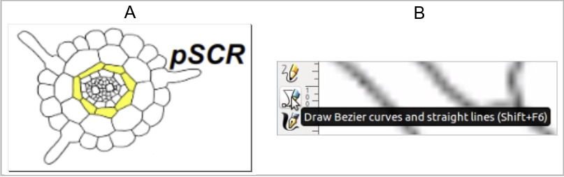
```

Select "Fill and Stroke..." under the "Object" tab on the top (Figure \@ref(fig:topStroke)A). On the right panel "Fill and Stroke (Shift+Ctrl+F)", set "Stroke style" 3.000 px (Figure \@ref(fig:topStroke)B) and press "Enter" key. 

```{r topStroke, echo=FALSE, fig.wide=TRUE, out.width="70%", fig.cap=("Open the 'Fill and Stroke' panel.")} 
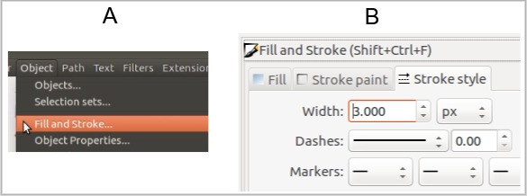
```

Press the "+" key to zoom in and select a template shape to start. Draw an outline for each shape by clicking at differencet corners of the shape (Figure \@ref(fig:drawSeal)A-B). At last, click at the start point to seal the outline (Figure \@ref(fig:drawSeal)C), then a spatial feature is created.   

```{r drawSeal, echo=FALSE, fig.wide=TRUE, out.width="90%", fig.cap=("Drawing spatial features with a tempate.")} 
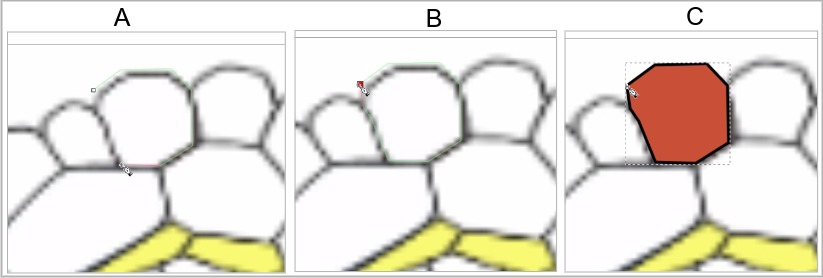
```

If the created spatial feature is filled with a color, click "No paint" under the "Fill" tab on the panel "Fill and Stroke (Shift+Ctrl+F)" (Figure \@ref(fig:transPly)A). Then it will become transparent (Figure \@ref(fig:transPly)B). 

```{r transPly, echo=FALSE, fig.wide=TRUE, out.width="90%", fig.cap=("Transparent spatial features.")} 
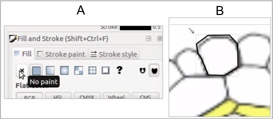
```

Select "Edit paths by nodes (F2)" on the left tool bar (Figure \@ref(fig:toCorner)A), and draw a rectangle over the created spatial feature (Figure \@ref(fig:toCorner)B). Select "Make selected nodes corner" (Figure \@ref(fig:toCorner)C) on the top.  

```{r toCorner, echo=FALSE, fig.wide=TRUE, out.width="80%", fig.cap=("Turn nodes to corners.")} 
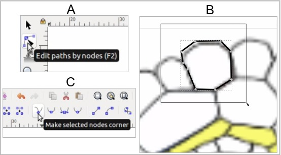
```

Drag nodes and edges to well align the spatial feature with the template shape (Figure \@ref(fig:refinePly)A). On the fill and stroke panel, under the "Fill" tab select "Flat color" and optionally adjust the color scales to label the spatial feature (Figure \@ref(fig:refinePly)B). Then the first spatial feature is done (Figure \@ref(fig:refinePly)C).   

```{r refinePly, echo=FALSE, fig.wide=TRUE, out.width="90%", fig.cap=("Refine spatial features.")} 
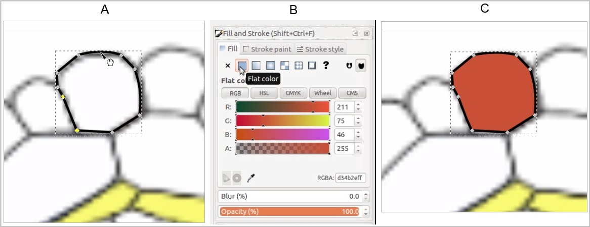
```

## Using Geometric Shapes 

This section showcases transforming basic geometric shapes (e.g. rectangles and circles) into spatial features, serving as a method to create the second spatial feature.   

Select "Create rectangles and squares (F4)" on the left (Figure \@ref(fig:useShape)A), and draw a rectangle object (Figure \@ref(fig:useShape)B). Convert this object to paths by selecting "Object to Path" under the "Path" tab on the top (Figure \@ref(fig:refinePly)C).   

```{r useShape, echo=FALSE, fig.wide=TRUE, out.width="90%", fig.cap=("Converting geometric shapes into paths.")} 
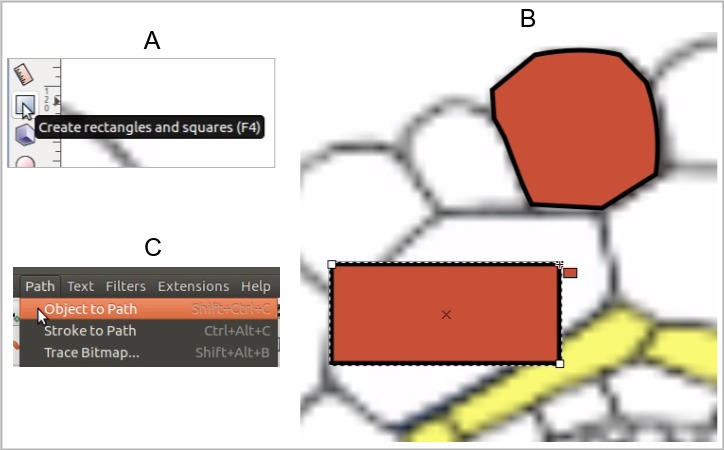
```

Click "No paint" under the "Fill" tab on the fill and stroke panel to make the rectangle transparent (Figure \@ref(fig:alignRec)A). Rotate the rectangle if needed (Figure \@ref(fig:alignRec)B). Select "Edit paths by nodes (F2)" on the left tool bar. If necessary, add a node by double-clicking on an edge (Figure \@ref(fig:alignRec)C). Drag nodes and edges to align the rectangle with the underlying shape template (Figure \@ref(fig:alignRec)C). 
  
```{r alignRec, echo=FALSE, fig.wide=TRUE, out.width="90%", fig.cap=("Adding nodes to rectangles.")} 
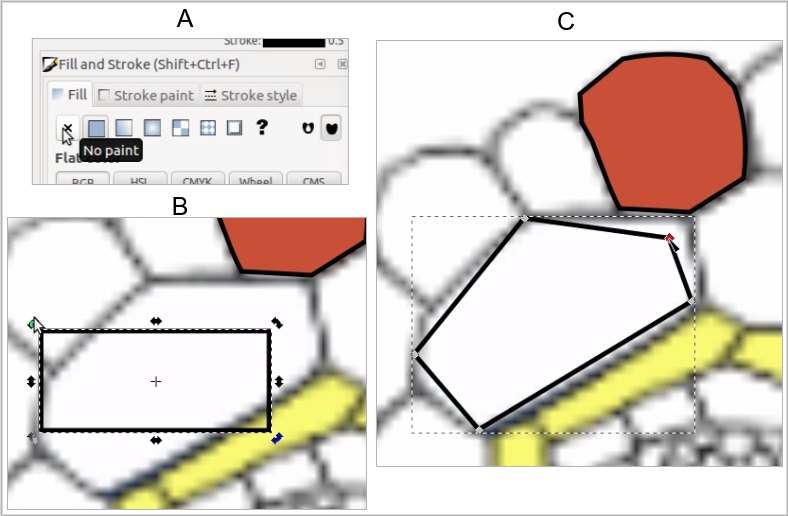
```

Select "Edit paths by nodes (F2)" on the left tool bar (Figure \@ref(fig:alignRec1)A), and draw a rectangle over the spatial feature (Figure \@ref(fig:alignRec1)B). Select "Make selected nodes corner" on the top (Figure \@ref(fig:alignRec1)C).   

```{r alignRec1, echo=FALSE, fig.wide=TRUE, out.width="90%", fig.cap=("Aligning rectangles with template shapes.")} 
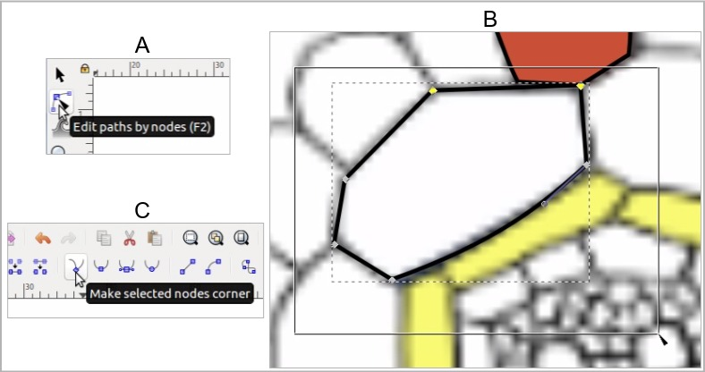
```

Drag the handles at the nodes of the spatial feature to fine adjust the edges for alignment with the template shape (Figure \@ref(fig:ft2)A). On the fill and stroke panel select "Flat color" under the "Fill" tab to optionally color this spatial feature (Figure \@ref(fig:ft2)B). Then the second spatial feature is done.   

```{r ft2, echo=FALSE, fig.wide=TRUE, out.width="90%", fig.cap=("Spatial features created with geometric shapes.")} 
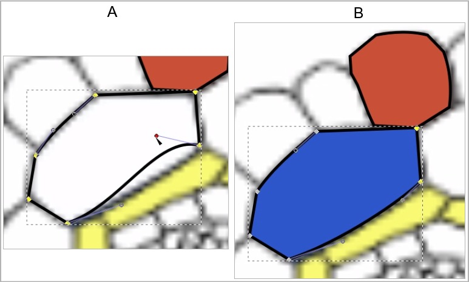
```

## Using GIMP

If shapes in the template image have clear outlines, the SVG image can be automatically extracted with [GIMP](https://www.gimp.org/){target="_blank"}. Note, unclear outlines would lead to extraction of messy spatial feature.   

### Extracting Shapes

Open the template image in GIMP (Figure \@ref(fig:byColor)A), then open the "Paths" panel (Figure \@ref(fig:byColor)B-C). Right click and select "By Color" (Figure \@ref(fig:byColor)D).  

```{r byColor, echo=FALSE, fig.wide=TRUE, out.width="90%", fig.cap=("Selecting shapes by colors.")} 
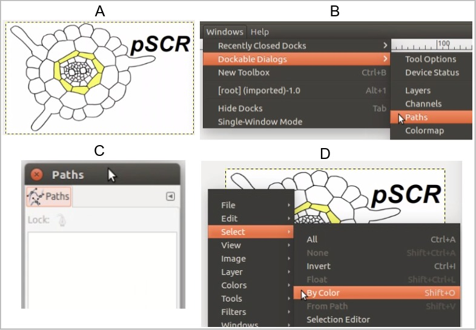
```

Now the shapes can be selected by colors. For exmaple, first click on a whilte shape to select all shapes in white, then right click and select "To Path" (Figure \@ref(fig:toPath)A). After that, all the white shapes are extracted to the "Paths" panel (Figure \@ref(fig:toPath)B). Similarly, extract shapes of other colors.  

```{r toPath, echo=FALSE, fig.wide=TRUE, out.width="90%", fig.cap=("Exporting shapes to paths.")} 
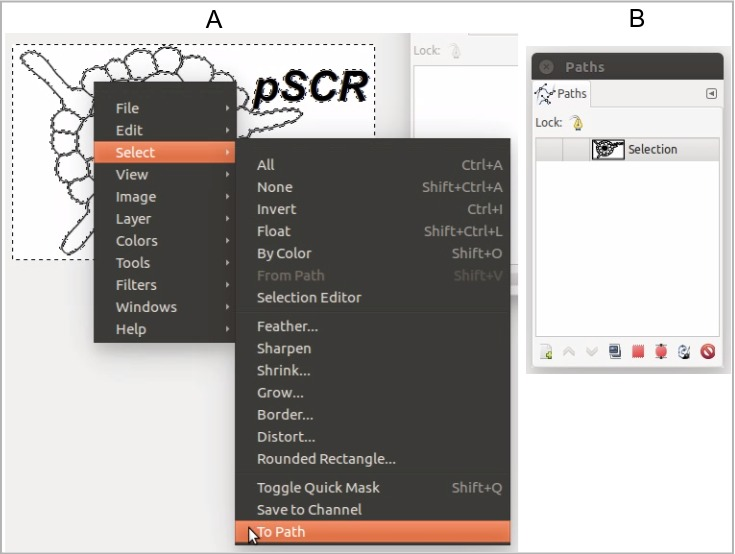
```

Click in front of each extracted shape to show the "eye" icon (Figure \@ref(fig:exp)A). Mouse over the extracted shapes, right click, select "Merge Visible Paths" (Figure \@ref(fig:exp)B). After merged, export the paths as an SVG image (here [root_gimp.svg](https://raw.githubusercontent.com/jianhaizhang/SVG_tutorial/master/download/root_gimp.svg){target="_blank"}) (Figure \@ref(fig:exp)C). Next, proceed to edit the exported SVG image in Inkscape.  

```{r exp, echo=FALSE, fig.wide=TRUE, out.width="90%", fig.cap=("Exporting shapes as an SVG file.")} 
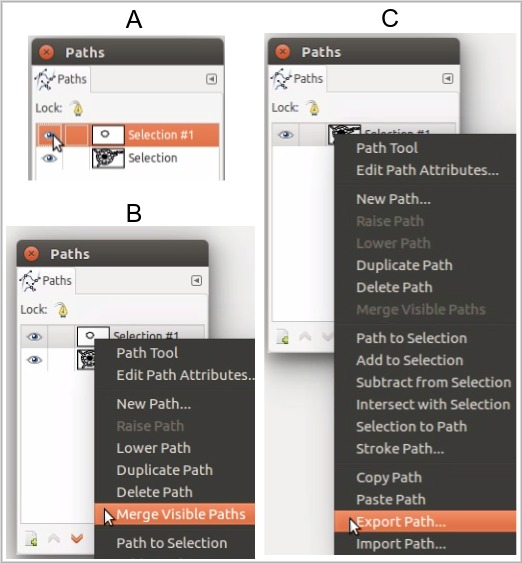
```

### Edit the Extracted SVG

Open the exported SVG image (root_gimp.svg) in Inkscape (Figure \@ref(fig:gimpFill)A). Under 'Object' tab at the top, select "Fill and Stroke..." (Figure \@ref(fig:topStroke)A). To make all shapes visible, click the image, select "Flat color" the under "Fill" tab, then adjust color scales (Figure \@ref(fig:gimpFill)B-C).     

```{r gimpFill, echo=FALSE, fig.wide=TRUE, out.width="90%", fig.cap=("Opening the extracted SVG in Inkscape.")} 
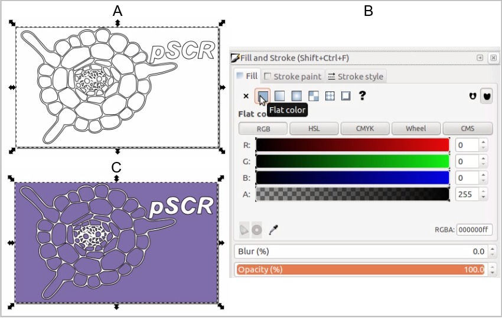
```

By default, all shapes (paths) in the SVG image extracted by GIMP are combined as a whole. To separate them, first click the image then click "Break Apart" under the top "Path" tab (Figure \@ref(fig:breakPath)A). After separated, the shape outlines are not stroked by default. To stroke the outlines, first use "Ctrl+A" to select all shapes, on the fill and stroke panel select "Flat color" under the "Stroke paint" tab (Figure \@ref(fig:breakPath)B), then set a number under the "Stroke style" tab (e.g. 1.333 px) (Figure \@ref(fig:breakPath)C).   

```{r breakPath, echo=FALSE, fig.wide=TRUE, out.width="90%", fig.cap=("Breaking combined paths.")} 
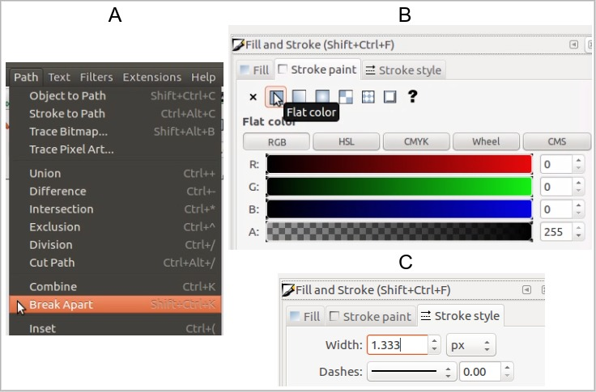
```

Click anywhere in the white area to unselect the whole image. Press "+" key to zoom in, then move certain shapes to expected locations if needed. To delete byproduct shapes, first select them then press the "Delete" key (Figure \@ref(fig:gimpDel)A-C).  

```{r gimpDel, echo=FALSE, fig.wide=TRUE, out.width="90%", fig.cap=("Deleting byproduct shapes.")} 
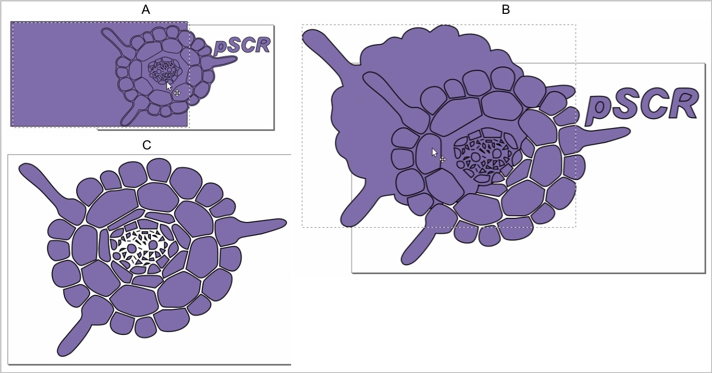
```

Use "Ctrl+A" to select all shapes. Click "No paint" under the "Fill" tab on the fill and stroke panel (Figure \@ref(fig:edited)A). Click anywhere in the white area to unselect the whole image. Then the editing of the extracted SVG by GIMP is done. The edited SVG file (Figure \@ref(fig:edited)B) is downloadable [here](https://raw.githubusercontent.com/jianhaizhang/SVG_tutorial_file/master/download/root_gimp_blank.svg){target="_blank"}.    

```{r edited, echo=FALSE, fig.wide=TRUE, out.width="90%", fig.cap=("Edited SVGs.")} 
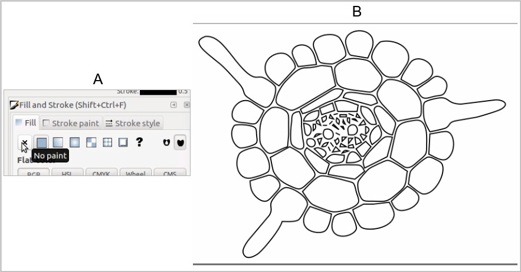
```

## Dealing with Many Shapes

If the SVG image includes numerous spatial features (Figure \@ref(fig:shapeLayer)A), the speed of creating SHMs in *spatialHeatmap* could be compromised. In such cases, a workaround is to overlay elongated and thin shapes existing in two layers to visually represent smaller shapes (Figure \@ref(fig:shapeLayer)B). This strategy allows shared borders between spatial features and thus improves the runtime when *spatialHeatmap* extracting coordinates of the spatial features.  

```{r shapeLayer, echo=FALSE, fig.wide=TRUE, out.width="90%", fig.cap=("SVGs including many spatial features.")} 
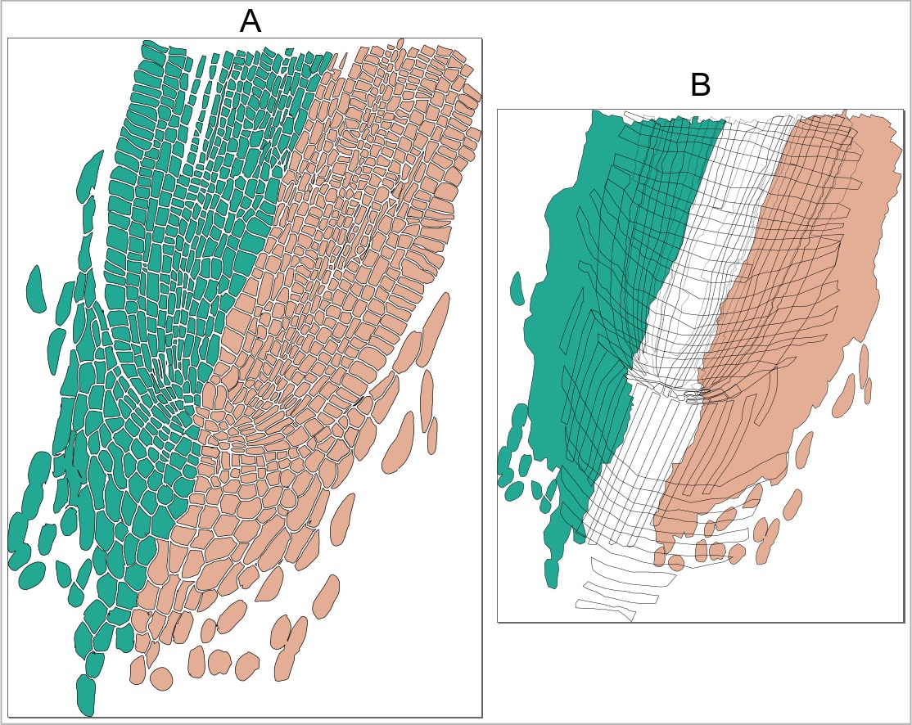
```

# Formatting SVGs {#formatSVG}

For plotting SHMs with *spatialHeatmap*, the spatial features in the SVGs should be formatted according to some conventions. This section focuses on the details of formatting SVGs. In addition, SVGs from [EBI Anatomogram](https://github.com/ebi-gene-expression-group/anatomogram/tree/master/src/svg){target="_blank"} are also supported in *spatialHeatmap*.   


## Grouping 

If a complex spatial feature consists of multile sub-features, these sub-features should be grouped rather than combined (Ctrl+K). Take the root atrichoblast epidermis feature as example. First, select the sub-features of this tissue by clicking their edges while holding down the "Shift" key (Figure \@ref(fig:group)A). Next, mouse over any edge of the selected sub-features, then right-click and choose "Group" (Figure \@ref(fig:group)B). Note, if the spatial features are not expected to be colored in SHMs, it is not necessary to group them.

```{r group, echo=FALSE, fig.wide=TRUE, out.width="90%", fig.cap=("Grouping spatial features.")} 
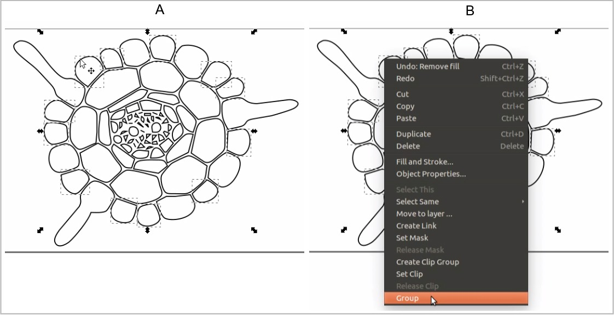
```

In order to make the grouped spatial features visually different from other features, the group can be colored. Sepecifically, click "Flat color" under the "Fill" tab on the fill and stroke panel (Figure \@ref(fig:fillGrp)A), then fill the group with a preferred color (Figure \@ref(fig:fillGrp)B).   

```{r fillGrp, echo=FALSE, fig.wide=TRUE, out.width="90%", fig.cap=("Coloring the grouped spatial features.")} 
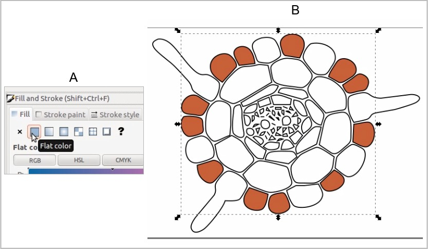
```

## Resizing Groups

A group (e.g. root_pSCR/root endodermis in Figure \@ref(fig:resize)B) could be resized by simply dragging the black arrows on the edge or changing the width (H), height (H) values on the top toolbar. In either case, in the "XML Editor" panel the resized group would have an attribute of `transform` with a value of `matrix` (Figure \@ref(fig:resize)B), indicating the coordinates of this group are transformed because of resizing. *spatialHeatmap* does not accept this "tranform-matrix" pair in groups. To remove this attribute, simply ungroup (Ctrl+Shift+G) and regroup (Ctrl+G) the relevant spatial features.    

```{r resize, echo=FALSE, fig.wide=TRUE, out.width="90%", fig.cap=("Resizing grouped spatial features.")} 
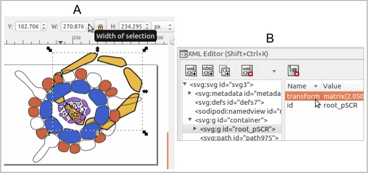
```

## Annotating {#ann}

To enable coloring based on numeric values in the assay data, it's necessary for spatial features to be annotated with unique identifiers that correspond to their counterparts in the data. The annotated SVGs are referred to as aSVGs. For grouped features, the group rather individual features needs to be annotated. Figure \@ref(fig:ann) is the annotating of the "root_pGL2" (root atrichoblast epidermis) group. Specifically, under the "Edit" tab on the top (Figure \@ref(fig:ann)A), select "XML Editor..." (Figure \@ref(fig:ann)B). Click the "root_pGL2" feature to select it. On the "XML Editor (Shift+Ctrl+X)" panel, first click "id", then type in "root_pGL2" and click "Set" at the bottom. Note, if the spatial features are not expected to be colored in SHMs, it is not necessary to annotate them.  

```{r ann, echo=FALSE, fig.wide=TRUE, out.width="90%", fig.cap=("Annotating spatial features.")} 
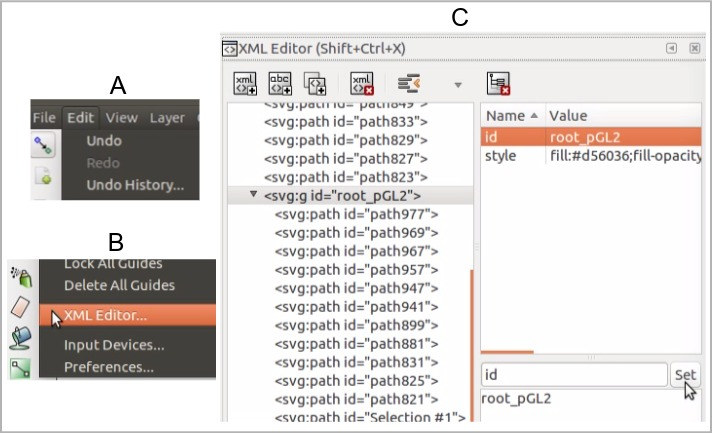
```

In addition, it is optional to add an "ontology" attribute for spatial features. Take the spatial feature "root_pGL2" (root atrichoblast epidermis) as an example. First, retrieve the ontology id for this feature at [Ontology Lookup Service](https://www.ebi.ac.uk/ols/index){target="_blank"}. Click the feature in the XML Editor, at the bottom type "ontology" and the retreived id in front of and below "Set" respectively, then click "Set" (Figure \@ref(fig:ont)).  

```{r ont, echo=FALSE, fig.wide=TRUE, out.width="90%", fig.cap=("Adding ontology ids to spatial features.")} 
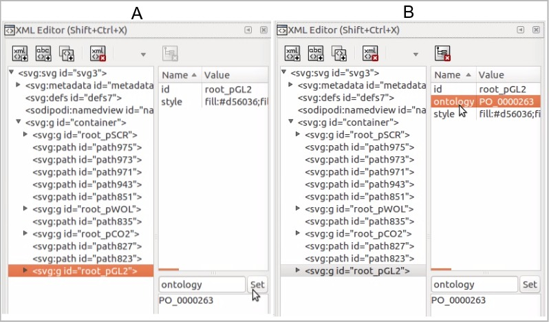
```

Similarly, group and annotate other spatial features as required. When grouping the small vasculature features in the center, a shortcut is to draw a rectangle over them to select multiple features, instead of clicking on each one individually. Figure \@ref(fig:final) is the final aSVG of Arabidopsis root, colors representing different spatial features.   

```{r final, echo=FALSE, fig.wide=TRUE, out.width="60%", fig.cap=("The aSVG of Arabidopsis root")} 
include_graphics('image/final.png')
```

## Text Group 

It is optional to include text in the aSVG. First click "Create and edit text objects (F8)" on the left tool bar (Figure \@ref(fig:text)A), then click on the target position and type text, here "root_pGL2" (Figure \@ref(fig:text)B).    

```{r text, echo=FALSE, fig.wide=TRUE, out.width="80%", fig.cap=("Adding text to aSVGs.")} 
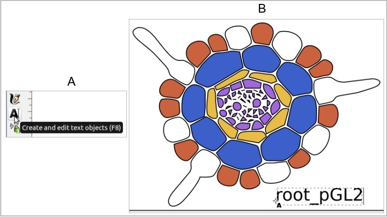
```

On top tool bar, click on "View and select font family, font size, and other text properties (Shift+Ctrl+T)" (Figure \@ref(fig:textSty)A), then on the text panel, change text styles such as font size (Figure \@ref(fig:textSty)B).  

```{r textSty, echo=FALSE, fig.wide=TRUE, out.width="80%", fig.cap=("Changing text styles.")} 
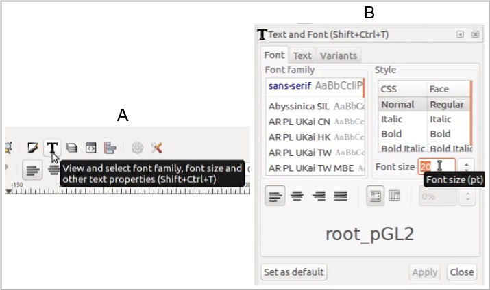
```

Select the text object and convert it to path (Figure \@ref(fig:textPa)), then the text becomes a group (indicated by "svg:g" in Figure \@ref(fig:textPa)B).     

```{r textPa, echo=FALSE, fig.wide=TRUE, out.width="80%", fig.cap=("Converting text objects to paths.")} 
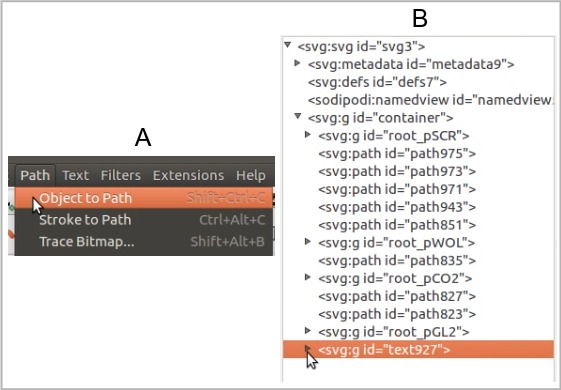
```

The [id](#ann) of a text group must have specific prefixes and suffixes to achieve the desired appearance in SHMs. Specifically, the prefix should be "text"; otherwise, the text letters in SHMs might become distorted. The suffix should be either "_localLGD" or "_globalLGD"; otherwise, the text color (black) might be missing and the text could appear transparent. If "_localLGD" is used, the text will only be present in the legend plot (Figure \@ref(fig:shm) right), while if "_globalLGD" is used, the text will be present in both the SHM (Figure \@ref(fig:shm) middle) and the legend plots. An example of a valid text group id is "text927_globalLGD".   

```{r textlgd, echo=FALSE, fig.wide=TRUE, out.width="100%", fig.cap=("Text group ids.")} 
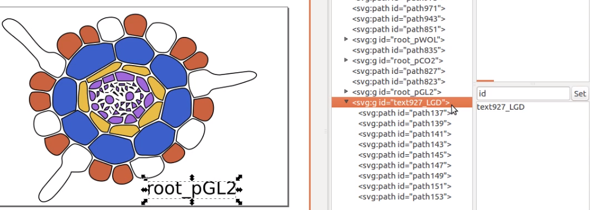
```

If non-text shapes are included as legends, their ids only need to have the suffix "_localLGD" or "_globalLGD" such as "rect161_globalLGD". Without these suffixes, the legend may appear transparent in SHMs.   

```{r lgd, echo=FALSE, fig.wide=TRUE, out.width="100%", fig.cap=("Non-text legends.")} 
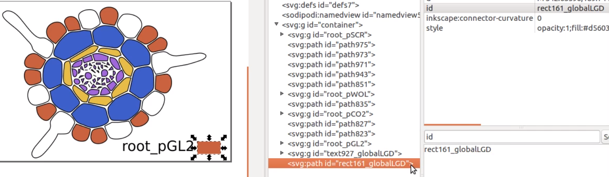
```

## Final Grouping

All shapes, including text, need to be grouped as a whole. The id of this overall group can be random. To achieve this, select all the shapes using "Ctrl+A," mouse over the selection, right-click, and then click "Group" (Figure \@ref(fig:finalgrp)A). It's important to note that this overall group must be the last element in the 'XML Editor' (Figure \@ref(fig:finalgrp)B).  

```{r finalgrp, echo=FALSE, fig.wide=TRUE, out.width="90%", fig.cap=("Grouping all shapes.")} 
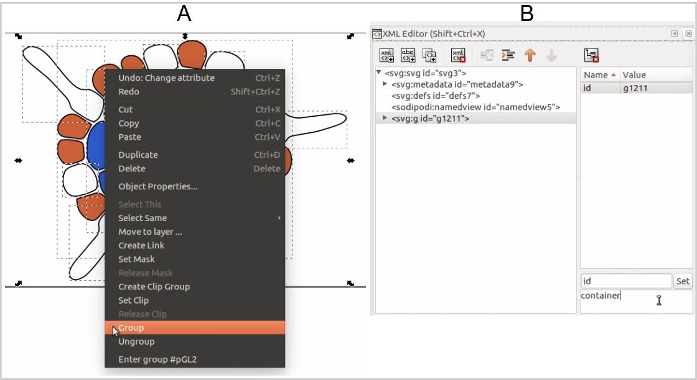
```

## Absolute Positions {#abs}

All the shapes need to have absolute positions. To achieve so, click "Preferences..." under the "Edit" tab (Figure \@ref(fig:pos)A). Next, go to "Input/Output" → "SVG Output" → "Path data" → "Path string format", then select "Absolute" (Figure \@ref(fig:pos)B). To trigger the effcts on all shapes, click "Select All in All Layers" under the "Edit" tab (Figure \@ref(fig:pos)C), and use the arrow key to nudge the selection, e.g. one step forward and one step backward. Then all the shapes are rewritten and absolutely positioned. The absolut position is indicated by the capital letters (M, C, etc.) in the "d" attribute of a shape (Figure \@ref(fig:pos)D).   

```{r pos, echo=FALSE, fig.wide=TRUE, out.width="90%", fig.cap=("Absolution postitions for each shape.")} 
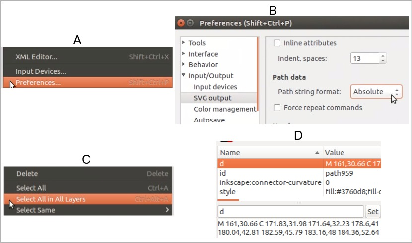
```

## Resizing Canvas {#resize}

To ensure the best overall height and width of the aSVG, go to "Document Properties..." under the "File" tab and select "Custom size" under the "Page" tab, then set "Units" to "px" and click on "Resize page to drawing or selection" (Figure \@ref(fig:canvas)). The fully formatted Arabidopsis root aSVG file is downloadable [here](https://raw.githubusercontent.com/jianhaizhang/SVG_tutorial/master/download/arabidopsis.thaliana_root.cross_shm.svg){target='_blank'}.   

```{r canvas, echo=FALSE, fig.wide=TRUE, out.width="90%", fig.cap=("Adjusting overall height and width of the aSVG.")} 
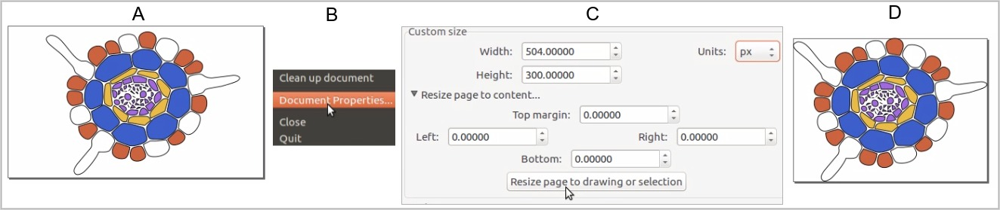
```

## Naming Scheme  

In *spatialHeatmap*, the naming convention for the aSVG file follows the pattern "\<species\>_[view]_shm.svg," for example, "arabidopsis.thaliana_root.cross_shm.svg." It's important to note that the aSVG file name must end with ".svg," and the beginning of the file name should only include letters, digits, dots, or underscores. Parentheses should be avoided. For instance, a name like "arabidopsis.thaliana_root.cross_shm(1).svg" is not supported.

# Formatting the Data {#formatData}

When plotting SHMs, only spatial features that have common identifiers between the aSVG and assay data are colored. As a result, it's crucial to format the assay data. The supported data containers include `vector`, `data frame`, and `SummarizedExperiment` (SE) [@SummarizedExperiment]. This section focuses on `SE`. Details of the other two data containers are provided in the *spatialHeatmap* [vignette](https://bioconductor.org/packages/devel/bioc/vignettes/spatialHeatmap/inst/doc/spatialHeatmap.html#61_Numeric_Data){target='_blank'}.   

For plotting SHMs, the two most important slots in `SE` are `assay` and `colData`. The `assay` slot stores the numeric data matrix, where rows and columns are biomolecules (e.g. genes) and samples respectively, while the `colData` slot stores experimental design information such as replicates and treatments. Formatting `SE` objects is essentially editing information in the `colData` slot.    

The experimental design information can be imported to the `colData` slot from a tabular targets file. The target file should meet the following requirements:  

1. It contains at least two columns. One column represents spatial features (`spFeature`) and the other one experimental variables (`variable`) such as treatments. The rows in the target file correspond to the columns of the numeric data stored in the `assay` slot.     
 
2. To be colored in SHMs, the spatial features must have common identifiers between the assay data and aSVG. Note, the double underscore is a special string reserved for specific purposes in *spatialHeatmap*, and thus should be avoided for naming spatial features and variables.   

The following example illustrates the design of a valid `SummarizedExperiment` object for generating SHMs. In this example, "root_pGL2" (root atrichoblast epidermis) has 2 experiment variables ("control" and "hypoxia") and each has 2 replicates. Thus, there are 4 assays for "root_pGL2". The same design applies to `root_pCO2` (root cortex). These information is stored in a targets file `target.test`.   

```{r eval=TRUE, echo=TRUE, warnings=FALSE }
spft <- c(rep('root_pGL2', 4), rep('root_pCO2', 4))
vars <- rep(c('control', 'control', 'hypoxia', 'hypoxia'), 2)
target.test <- data.frame(spFeature=spft, variable=vars, row.names=paste0('assay', 1:8))
target.test
```

The `assay` slot is populated with a `data.frame` containing random
numbers. Each column corresponds to an assay in the target file, while each row corresponds to a gene. 

```{r eval=TRUE, echo=TRUE, warnings=FALSE }
set.seed(10)
df.se <- data.frame(matrix(sample(x=1:1000, size=160), nrow=20))
rownames(df.se) <- paste0('gene', 1:20)
colnames(df.se) <- row.names(target.test)
df.se[1:3, ]
```

Next, a `SummarizedExperiment` object is constructed by providing the
numeric and target data under the `assays` and `colData` arguments,
respectively.

```{r eval=TRUE, echo=TRUE, warnings=FALSE }
se <- SummarizedExperiment(assays=df.se, colData=target.test)
se
```

The replicates are aggregated by means.    

```{r eval=TRUE, echo=TRUE, warnings=FALSE }
se.aggr <- aggr_rep(data=se, sam.factor='spFeature', con.factor='variable', aggr='mean')
assay(se.aggr)[1:2, ]
```

The aSVG file "arabidopsis.thaliana_root.cross_shm.svg" created in this tutorial are imported to an `SVG` object (see details [here](https://bioconductor.org/packages/devel/bioc/vignettes/spatialHeatmap/inst/doc/spatialHeatmap.html#13_Image_Format:_SVG){target='_blank'}). The annotated spatial features are stored in the "feature" column.      

```{r eval=TRUE, echo=TRUE, warnings=FALSE, results='show', collapse=TRUE}
svg.root <- read_svg('data/arabidopsis.thaliana_root.cross_shm.svg')
svg.root[, 2][[1]][1:3, 1]
```

Spatial features between the assay data and aSVG have common identifiers.   

```{r eval=TRUE, echo=TRUE, warnings=FALSE, results='show'}
se.aggr$spFeature %in% svg.root[, 2][[1]]$feature
```

# Spatial Heatmaps {#shm}

With the fully formatted assay data and aSVG, SHMs are plotted for gene1. 

```{r shm, eval=TRUE, echo=TRUE, warnings=FALSE, fig.wide=FALSE, fig.cap=c('SHMs created with a `SummarizedExperiment` object. Spatial features having common identifiers between the assay data and aSVG are colored.'), results='hide'}
dat <- SPHM(svg=svg.root, bulk=se.aggr)
shm(data=dat, sam.factor='spFeature', con.factor='variable', ID=c("gene1"), legend.nrow=4, bar.width=0.1, legend.r=1, h=0.7)
```

# Troubleshooting 

If errors occur when plotting SHMs, the following suggestions may be helpful:  

1. Make sure that spatial feature groups do not contain nested groups.   

2. SVGs are XML-like files (as shown in Figure \@ref(fig:finalgrp)B). Ensure that the SVG elements used are limited to "g," "path," "rect," "ellipse," "use," and "title." Using other elements could result in errors or warnings when utilizing *spatialHeatmap*. Note that "use" elements are not permitted within "g" elements.   

3. Carefully review the formatting conventions for both [SVGs](#formatSVG) and [assay data](#formatData) to ensure compliance. 


```{r eval=TRUE, echo=TRUE, warnings=FALSE }
sessionInfo()
```

# Reference


