--- 
title: "SVG Tutorial for spatialHeatmap"
author: "Jianhai Zhang, PhD student at Genetics, Genomics and Bioinformatics, University of California, Riverside (<jzhan067@ucr.edu>; <zhang.jianhai@hotmail.com>) <p/> PI: Dr. Thomas Girke, professor at Department of Botany and Plant Sciences, University of California, Riverside (<thomas.girke@ucr.edu>)"
date: "Last update: `r format(Sys.time(), '%d %B, %Y')`"
output:
  html_document:
    toc: true
    toc_float:
        collapsed: true
        smooth_scroll: true
    toc_depth: 3
    fig_caption: yes
    code_folding: show
    number_sections: true
    self_contained: true
fontsize: 14pt
bibliography: bibtex.bib
package: spatialHeatmap
vignette: |
  %\VignetteIndexEntry{SVG tutorial for spatialHeatmap}
  %\VignetteEngine{knitr::rmarkdown}
  %\VignetteEncoding{UTF-8}
---

  Maintainer: Jianhai Zhang  

<style>body { text-align: justify }</style>

```{r setup0, echo=FALSE, message=FALSE, warning=FALSE}
library(knitr); opts_chunk$set(message=FALSE, warning=FALSE)
```

# Introduction

## The `spatialHeatmap` Package

The `spatialHeatmap` package provides functionalities for visualizing cell-, tissue- and organ-specific data of biological assays by coloring the corresponding spatial features defined in anatomical images according to a numeric color key. The color scheme used to represent the assay values can be customized by the user. This core functionality is called a *spatial heatmap* plot. It is enhanced with nearest neighbor visualization tools for groups of measured items (*e.g.* gene modules) sharing related abundance profiles, including matrix heatmaps combined with hierarchical clustering dendrograms and network representations.  

Related software tools for biological applications in this field are largely based on pure web applications [@Winter2007-bq; @Waese2017-fx] or local tools [@Maag2018-gi; @Muschelli2014-av] that typically lack customization functionalities. These restrictions limit users to utilizing pre-existing expression data and/or fixed sets of anatomical image collections. To close this gap for biological use cases, we have developed `spatialHeatmap` as a generic R/Bioconductor package for plotting quantitative values onto any type of spatially mapped images in a programmable environment and/or in an intuitive to use graphical user interface (GUI) application. For details, refer to the package [vignette](https://jianhaizhang.github.io/SVG_tutorial_file/vignette.html). 

## Tutorial Overview

To plot spatial heatmaps, a pair of formatted data and aSVG (see [aSVG](#repo) below) image are required. The latter can come from the [aSVG repository](#repo) or created by users. If the target aSVG image is not available in this repository, users should make a custom aSVG image. This tutorial explains the detailed process of making aSVG images. To reproduce the results in this tutorial, all the used files are available to [download](https://github.com/jianhaizhang/SVG_tutorial_file/tree/master/download).   

This tutorial first introduces the [aSVG repository](#repo). Second, three ways of making SVG shapes in [Inkscape](https://inkscape.org/) are presented. Third, the requirements on data format are explained. The `spatialHeatmap` package is able to work with [EBI aSVGs](#repo) directly. However, for the purpose of plotting spatial heatmaps there are unnecessary format requirements on these aSVGs, thus in the fourth section the simplified aSVG format is presented. The fifth section illustrates conversion from the simplified aSVG format to the advanced EBI aSVG format. If users make custom aSVGs only for their own use, the simplified format is recommended, since it is easier and time-saving. If they want to share with other EBI users they should follow the advanced format. Lastly, spatial heatmaps are demonstrated on the aSVG created in this tutorial.  

# Getting Started  

## Installation  

The `spatialHeatmap` package should be installed from an R (version $\ge$ 3.6) session with the `BiocManager::install` command.  

```{r, eval=FALSE, echo=TRUE, warnings=FALSE} 

if (!requireNamespace("BiocManager", quietly = TRUE))
    install.packages("BiocManager")
BiocManager::install("spatialHeatmap")

```

## Load Packages and Documentation

Next, the packages required for running the sample code in this vignette need to be loaded.  

```{r, eval=TRUE, echo=TRUE, warnings=FALSE}

library(spatialHeatmap); library(SummarizedExperiment); library(GEOquery)

```

The following lists the vignette(s) of this package in an HTML browser. Clicking the corresponding name will open this vignette. 

```{r, eval=FALSE, echo=TRUE, warnings=FALSE}

browseVignettes('spatialHeatmap')

```

# aSVG Repository {#repo} 

To assign colors to specific features in spatial heatmaps, *annotated SVG* (aSVG) files are used where the shapes of interest are labeled according to certain conventions so that they can be addressed and colored programmatically. An aSVG repository, that can be used by `spatialHeatmap` directly, has been generated by the [EBI Gene Expression
Group](https://github.com/ebi-gene-expression-group/anatomogram/tree/master/src/svg). It
contains annatomical aSVG images from different species. These SVG images are 
also used by the Expression Atlas database. In addition, the `spatialHeatmap` has its own 
repository called [spatialHeatmap aSVG Repository](https://github.com/jianhaizhang/SVG_tutorial_file/tree/master/svg_repo), where some aSVG files developed in this project are already deposited (e.g. [Figure 1](#shm)). 

If users cannot find a target aSVG 
in the two repositories, this step-by-step SVG
tutorial for creating
custom aSVG images is recommended. The [BAR eFP browser](http://bar.utoronto.ca/) at University of Toronto contains many anotomical images, and these images are good templates for making custom aSVGs.  

We will add more aSVGs to our repository in the future and users are welcome to deposit their own aSVGs there to share with other `spatialHeatmap` users. 

# Make SVG Images 

To make SVG images, a PNG image with defined tissues and the SVG editor [Inkscape](https://inkscape.org/) are required. The image editor [GIMP](https://www.gimp.org/) can be used if the tissue outlines in the PNG image are clear. Inkscape is used to draw the SVG image with the PNG image as a template, and annotate the SVG image in accordance with the data. The values in data are used to color different tissues in spatial heatmaps. GIMP could be used to automatically extract shapes for the SVG image.  

There are 3 different options to make SVG images: Draw Over Template Shapes, Use Regular Shapes, Use GIMP. If tissues in the template image have unclear outlines, the first 2 options have to be used, as GIMP is applicable to tissues with clear outlines.  

## Draw Over Template Shapes {#draw}

Download the PNG image [root.png](https://github.com/jianhaizhang/SVG_tutorial_file/tree/master/download) (@Mustroph2009-nu, click the image, click 'Download', right click, and select "Save image as…") and open it in Inkscape. Select 'Draw Bezier curves and straight lines (shift+F6)' on the left tool bar.   
  <p/><center></center><p/>  

Select 'Fill and Stroke...' under 'Object' tab on the top. On the right panel 'Fill and Stroke (Shift+Ctrl+F)', set 'Stroke style' 3.000 px and press 'Enter' key. 

  <p/><center></center><p/>  

Press '+' key to zoom in and select a shape to start. Click at differencet corners of the shape to draw an outline. At last, click at the first corner to seal the outline.  

  <p/><center></center><p/>  

If the new shape is filled with a color, click 'No paint' under the 'Fill' tab on the panel 'Fill and Stroke (Shift+Ctrl+F)'. Then a new sealed transparent shape is completed.  

  <p/><center></center><p/>  

Select 'Edit paths by nodes (F2)' on the left tool bar, and draw a rectangle over the new shape. Select 'Make selected nodes corner' on the top.  

  <p/><center></center><p/>  

Drag nodes and edges to align the new shape with template shape. On the fill and stroke panel, under 'Fill' tab, select 'Flat color' and adjust the color scales to label the new shape. Then the first shape is made successfully.   

  <p/><center></center><p/>  

## Use Regular Shapes 

If the template shapes are similar to regular shapes such as rectangles, circles. The regular shapes can be used to make new shapes.

Select 'Create rectangles and squares (F4)' on the left, and draw a rectangle over a shape template. Convert this object to path by selecting 'Object to Path' under 'Path' tab on the top.   

  <p/><center></center><p/>  

Click 'No paint' under the 'Fill' tab on the fill and stroke panel to make the rectangle transparent. Rotate the rectangle. Select 'Edit paths by nodes (F2)' on the left tool bar. If necessary, add a node by double-clicking on an edge. Drag nodes and edges to align the rectangle with the underlying shape template. 
  
  <p/><center></center><p/> 

Select 'Edit paths by nodes (F2)' on the left tool bar, and draw a rectangle over the new shape. Select 'Make selected nodes corner' on the top.  

  <p/><center></center><p/>  

Drag the handles at nodes to adjust edges for fine alignment with the template shape. On the fill and stroke panel select 'Flat color' under 'Fill' tab to color this new shape. Then the new shape is successfully made.   

  <p/><center></center><p/>  


## Use GIMP

If shapes in the template PNG image have clear outlines, the SVG image can be extracted with [GIMP](https://www.gimp.org/), since unclear outlines would lead to messay SVG shapes.  

### Extract SVG image

Open the PNG template in GIMP, and open 'Paths' panel. Right click and select 'By Color'.  

  <p/><center></center><p/>  

Now the shapes can be selected by colors. For exmaple, clicking on a whilte shape selects all shapes in white. Right click, select 'To Path', then all the white shapes are extracted to the 'Paths' panel. Similarly, extract the yellow shapes.  

  <p/><center></center><p/>  

Click in front of each extracted shapes to show the 'eye' icon. Mouse over the extracted shapes, right click, select 'Merge Visible Paths'. After merged, export the paths as an SVG image (root_gimp.svg). Next, edit the exported SVG image in Inkscape.  

  <p/><center></center><p/>  

The exported SVG image `root_gimp.svg` is accessible [here](https://github.com/jianhaizhang/SVG_tutorial_file/tree/master/download) (hover over the image, right click, and select 'Save image as…').  

### Edit SVG Image in Inkscape

Open the exported SVG image in Inkscape. Under 'Object' tab at the top, select 'Fill and Stroke...'. First click the image, then select 'Flat color' under 'Fill' tab. Adjust color scales to fill the image.     

  <p/><center></center><p/>  

All the paths in SVG image generated in GIMP are combined as a whole. In order to separate the paths, first click the image then click 'Break Apart' under the top 'Path' tab. Now the paths/shapes are separated, but the outlines of shapes are not stroked. Thus use 'Ctrl+A' to select all shapes, on the fill and stroke panel select 'Flat color' under 'Stroke paint' tab, and set a number under 'Stroke style' tab (e.g. 1.333 px).   

  <p/><center></center><p/>  

Click the white area to unselect the whole image. Press '+' key to zoom in, try to move different shapes, and delete those unnecessary by pressing 'Delete' key.  

  <p/><center></center><p/>  

Use 'Ctrl+A' to select all shapes. Click 'No paint' under 'Fill' tab on the fill and stroke panel. Click the white area to unselect the whole image. The blank SVG image is ready to format with the data, which is downloadable [here](https://raw.githubusercontent.com/jianhaizhang/SVG_tutorial_file/master/download/root_gimp_blank.svg).    

  <p/><center></center><p/>  

# Format the Data

The bridges between data and aSVG are the sample features. Only features having matching counterparts between data and aSVG are colored in the spatial heatmaps. Therefore, the formatting process of SVG image is in accordance with the data formatting. The accepted data classes include `vector`, `data frame`, or `SummarizedExperiment` (SE) [@SummarizedExperiment]. Formatting the data is essentially to define samples and/or conditions. In the following, data formatting is explained on SE, since this data class is widely used in biological omics analysis. Details on `vector` and `data frame` are presented in [Supplement](#sup).  


SE applies to data involving many samples and conditions. The data matrix with rows and columns being genes and sample/conditions respectively is stored in the `assay` slot. The data formatting is essentially to make a targets file. It is a data frame and usually contains at least 2 columns defining replicates of samples and conditions respectively. The targets file is in the `colData` slot. In the `rowData` slot, a data frame of annotations for rows in `assay` is optionally added.  

The example data GSE14502 is from [GEO](https://www.ncbi.nlm.nih.gov/geo/). It is a microarray analysis on *Arabidopsis thaliana* root/shoot tissues under control and hypoxia [@Mustroph2009-nu], and is downloaded through GEOquery [@geo].  

Access the GEO dataset GSE14502 and convert it to `SummarizedExperiment`.  

```{r eval=TRUE, echo=TRUE, warnings=FALSE}
gset <- getGEO("GSE14502", GSEMatrix=TRUE, getGPL=TRUE)[[1]]
se.arab <- as(gset, "SummarizedExperiment")
```

Use gene symbols to replace probes.   

```{r eval=TRUE, echo=TRUE, warnings=FALSE}
rownames(se.arab) <- make.names(rowData(se.arab)[, 'Gene.Symbol'])
```

A slice of the data matrix in `assay` slot.  

```{r eval=TRUE, echo=TRUE, warnings=FALSE}
assay(se.arab)[1:3, c(25:29, 36:39)]
```

A slice of the experiment design, which is stored in `colData` slot.    

```{r eval=TRUE, echo=TRUE, warnings=FALSE}
colData(se.arab)[c(25:29, 36:39), 1:4]
```

The `title` column includes 'samples' and 'conditions', so it is used to make the targets file based on the following requirements.  

1. It is a data frame and usually has at least one column of samples and one column of conditions. The rows correspond with columns in assay slot. If the condition column is not defined, the samples are assumped under same condition.

2. The sample column specifies sample replicates. It is crucial that replicate names of the same sample must be identical. Otherwise, they are treated as different samples. E.g. 'root_pGL2' and 'root_pCO2' in [Table 1](#tar_arab).  

3. The sample identifiers of interest must be identical with features of interest in aSVG respectively. It means even a dot, undescore, space, etc can make a difference and lead to target features not colored in spatial heatmaps. Since double underscore (_\_) is a reserved separator in `spatialHeatmap`, it cannot be used in sample or condition identifiers.

4. The condition column has the same requirement with the sample column. E.g. 'control' and 'hypoxia' in [Table 1](#tar_arab).  

The completed targets file is packaged in `spatialHeatmap`, and is also downloadable [here](https://github.com/jianhaizhang/SVG_tutorial_file/tree/master/download) (click the file, click "Raw", right click, and select "Save as…"). Selected rows are shown in [Table 1](#tar_arab).   

```{r eval=TRUE, echo=TRUE, warnings=FALSE}
tar.arab <- system.file('extdata/shinyApp/example/target_arab.txt', package='spatialHeatmap')
target.arab <- read.table(tar.arab, header=TRUE, row.names=1, sep='\t')
```

```{r eval=FALSE, echo=TRUE, warnings=FALSE}
target.arab[c(25:29, 36:39), ]
```

<a name='tar_arab'></a>
```{r, eval=TRUE, echo=FALSE, warnings=FALSE}
df <- subset(target.arab, samples=='root_pGL2' |samples=='root_pCO2')[, 2:3]
kable(df, caption='Table 1 Targets file. Promoter pGL2, pCO2, pSCR, pWOL labels root atrichoblast epidermis, root cortex meristematic zone, root endodermis, root vasculature respectively. Only the first 2 are shown. ')
```

Use the targets file to replace the data frame in `colData` slot.   

```{r, eval=TRUE, echo=FALSE, warnings=FALSE}
colData(se.arab) <- DataFrame(target.arab)
```

As pre-proccesing conventions, gene expressoin profiling data should be normalized, aggregated, and filtered. The dataset GSE14502 is already normalised by RMA [@affy], so the pro-processing only includes replicate aggregation and filtering.   

The data is aggregated based on 'sample_\_condition' replicates internally, and a slice of the result is shown below.   

```{r eval=TRUE, echo=TRUE, warnings=FALSE }
se.aggr.arab <- aggr_rep(data=se.arab, sam.factor='samples', con.factor='conditions', aggr='mean')
assay(se.aggr.arab)[1:3, c(11:12, 16:17)]
```

Genes with expression values larger than 6 in at least 3% of all samples (pOA=c(0.03, 6)), and with coefficient of variance (CV) between 0.30 and 100 (CV=c(0.30, 100)) are retained.   

```{r eval=TRUE, echo=TRUE, warnings=FALSE }
# Filter genes with low variance and low intensity.
se.fil.arab <- filter_data(data=se.aggr.arab, sam.factor='samples', con.factor='conditions', pOA=c(0.03, 6), CV=c(0.30, 100), dir=NULL)
```

# Simplified aSVG Format

If users make aSVGs only for their own use rather than sharing with other EBI users, the simplified format is recommended, since it is easier and time-saving.   

## Requirements on Simplified aSVG Format

1. A path represents a shape. If a tissue consists of multiple paths and is expected to be colored in the spatial heatmap, all its paths must be grouped as a whole (labeled by tag `g`). A group should not include another group, which means all elements in a group should be single paths. However, if a multiple-path tissue is not expected to be colored in the spatial heatmap, there is no need to group them and the paths can keep random ids.

2. If a tissue is expected to be colored in the spatial heatmaps, its `id` value must have an identical tissue counterpart in the data/targets file. It means even a difference of dot, space, underscore, uppercase, or lowercase matters. If a tissue is a group, the group `id` is considered while the inside path ids are useless.  

3. In the end, all the tissues (groups and single paths) must be grouped together as a container group, and this large group must be the last element in the 'XML Editor'.  


## Group Same Tissues

In order to be colored in spatial heatmaps, tissues consisting of multiple shapes should be grouped. Take the `root_pGL2` as example. Select shapes of this tissue by clicking their edges while pressing 'Shift' key. Mouse over any edge of selected shapes, right click and select 'Group'.   

  <p/><center></center><p/>  

Click 'Flat color' under the 'Fill' tab on the fill and stroke panel, and fill the grouped shapes with a preferred color.   

  <p/><center></center><p/>  

## Set Tissue ID {#set_id}
  
Under the 'Edit' tab on the top, select 'XML Editor...'. Click the group to select it. On the 'XML Editor (Shift+Ctrl+X)' panel, first click the 'id' and type in `root_pGL2` then click 'Set'. It is critial that the id 'root_pGL2' has identical tissue counterpart in the data. Otherwise, this tissue will not be colored. After that, the first group is done.  

  <p/><center></center><p/>  

Similarly, group and set id for `root_pCO2`, `root_pSCR`, `root_pWOL` respectively. When group the small vasculature shapes in the center, a shortcut is to draw a rectangle over them to select all rather than clicking each individually. Note if a tissue sample contains only one shape, there is no need to group it, but the id should be identical with corresponding sample in the data in order to be colored in spatial heatmaps.  

  <p/><center></center><p/>

Brown, blue, orange, purple labels `root_pGL2`, `root_pCO2`, `root_pSCR`, `root_pWOL` respectively. The blank shapes have random ids and will not be colored in the spatial heatmap.   

## Container Group
  
At last, it is required to group all tissues (groups and independent paths) as a container group. To do so, use 'Ctrl+A' to select all, mouse over the selection, right click, and click group. Note it is optional to set a specific `id` for this container group.  

  <p/><center><p/>  

It is crucial that this container group must be the last element on the 'XML Editor'.   

  <p/><center></center><p/>  

## Absolute Path Position {#abs}

All the paths need to use absolute positions. To do so, click 'Preferences...' under 'Edit' tab. Go to 'Input/Output' → 'SVG Output' → 'Path data' → 'Path string format', and select 'Absolute'.  

  <p/><center>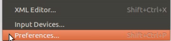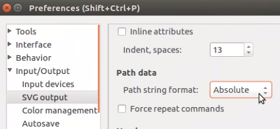</center><p/>  

This setting only affects newly created paths. To trigger the effcts on existing paths, click 'Select All in All Layers' under the 'Edit' tab, and use the arrow key to nudge the selection, e.g. one step forward and one step backward. Then all the paths are rewritten and absolutely positioned. The absolut position is exemplified by the capital letters in the 'd' attribute of a path.  

  <p/><center>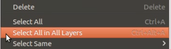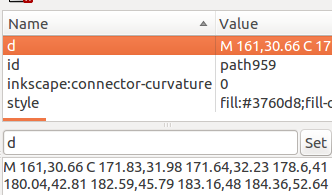</center><p/>  

By now, the simplified aSVG image is done. Save it as 'root_cross_simple.svg', which is downloadable [here](https://github.com/jianhaizhang/SVG_tutorial_file/tree/master/download). Note: the aSVG file name ends with '.svg' and the front should only consist of letters, digits, dots, or underscores. E.g. 'root_cross_simple(1).svg' is not acceptable.   

# Advanced aSVG Format

To work with the [Expression Atlas Anatomogram](https://github.com/ebi-gene-expression-group/anatomogram/tree/master/src/svg), the advanced aSVG format is required, and the specific requirements are listed at the bottom of this [page](https://github.com/ebi-gene-expression-group/anatomogram/tree/master/src/svg). The following sections illustrate the transition from the simplified format to advanced format.   

## Pre-set SVG attributes

Download the EBI SVG template [`EBI_template.svg`](https://github.com/jianhaizhang/SVG_tutorial_file/blob/63dc4bbb1269cdd3b4fb138ab56f389aca16a483/download/EBI_template.svg), which is made from the [Expression Atlas Anatomogram](https://github.com/ebi-gene-expression-group/anatomogram/tree/master/src/svg) and open it in Inkscape. It contains 2 layers `LAYER_OUTLINE` and `LAYER_EFO`. The former is expected to store organism outline shapes while the latter to store tissue shapes. As a template, both layers are empty except that `LAYER_OUTLINE` contains a green icon, which links to [Expression Atlas Licence](https://www.ebi.ac.uk/gxa/licence.html).  

  <p/><center>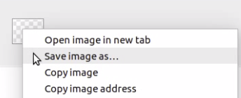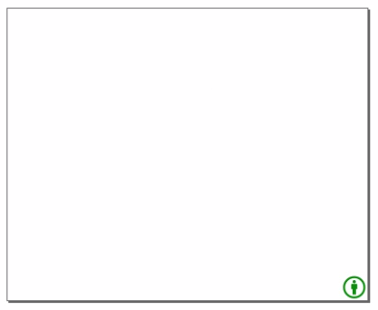</center><p/>  


Copy `height`, `width`, `viewBox` values in top `<svg ...>` tag from `root_cross_simple.svg` to `EBI_template.svg` respectively.  

  <p/><center>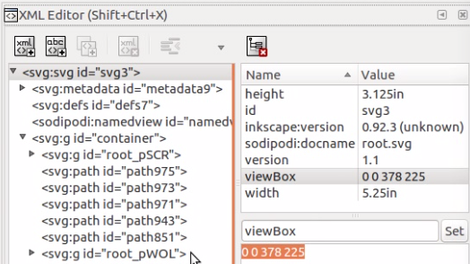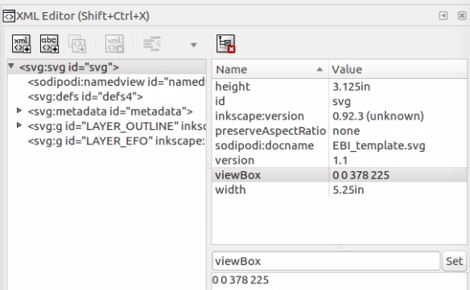</center><p/>  

The green icon might be shrunk. To resize the icon, select it, click the lock on the top toolbar, which maintains the aspect ratio, and increase the height (H) or width (W). Move the icon to the bottom left corner.  

  <p/><center>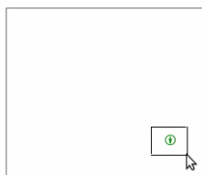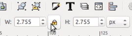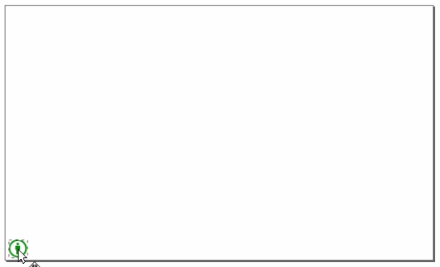</center><p/>  

## Copy Tissues to The Tissue Layer

In `root_cross_simple.svg`, ungroup (Ctrl+Shift+G) the container group, select all shapes, and copy all.   

  <p/><center>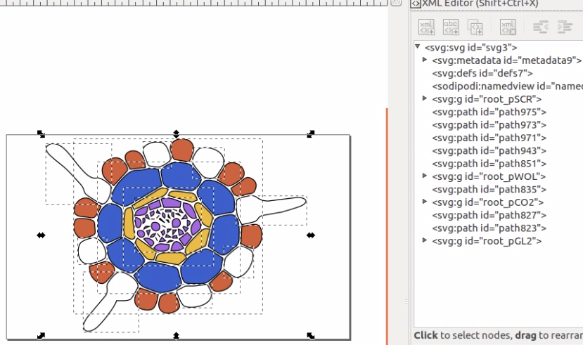</center><p/>  

In `EBI_template.svg`, open layer panel (Ctrl+Shift+L) and make sure the 'unlock' icon is in front of 'EFO' and 'Outline'. Click the 'EFO' layer, and paste all tissue shapes from `root_cross_simple.svg`. Then these shapes are inside the 'EFO' layer.  

  <p/><center>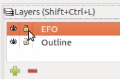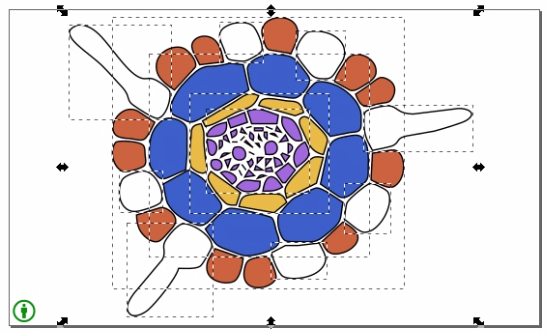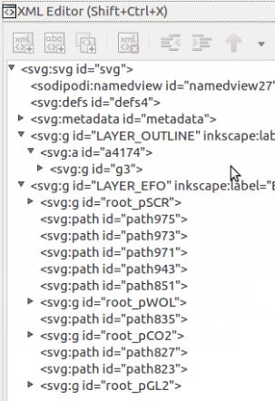</center><p/>  

## Annotate Tissues

The tissues in 'EFO' layer should be annotated, which includes ontology ids and tissue identifiers. Take the `root_pSCR` (root endodermis) tissue for example. Click the tissue in 'XML Editor', and click 'New element node' on the top. Type in 'svg:title' and click 'Create'. Then a `title` node is created at the bottom of `root_pSCR`. 

  <p/><center>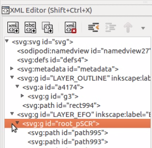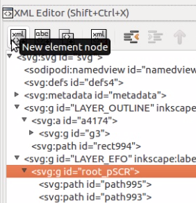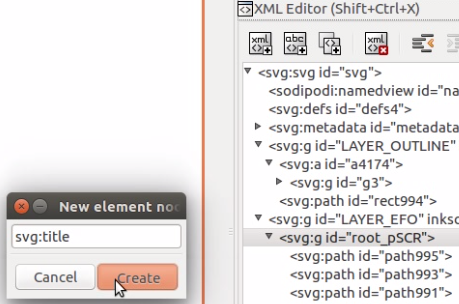</center><p/>  

Click the `title` node and click 'New text node' at the top. Then an empty text node is created inside the `title` node. Click the text node and type in 'root_pSCR' on the right.  

  <p/><center>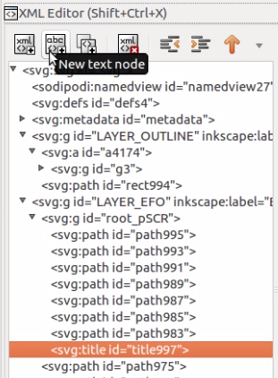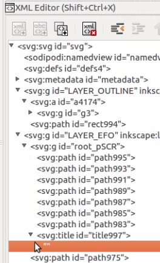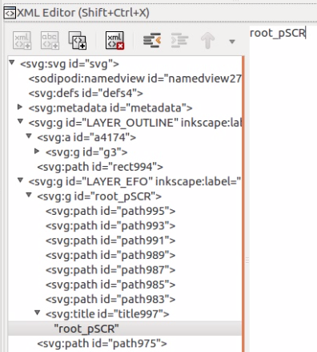</center><p/>  

Set title id as `root_pSCR`, then the title is done.  

  <p/><center>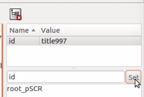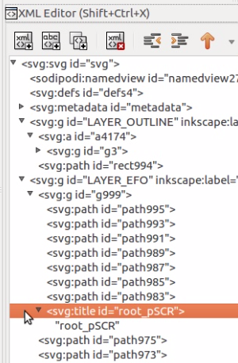</center><p/>  

Look up for 'root endodermis' that `root_pSCR` stands for in [Ontology Lookup Service](https://www.ebi.ac.uk/ols/index), and set the `root_pSCR` group id as `PO:0005059`. Then the annotation of `root_pSCR` is done.   

  <p/><center>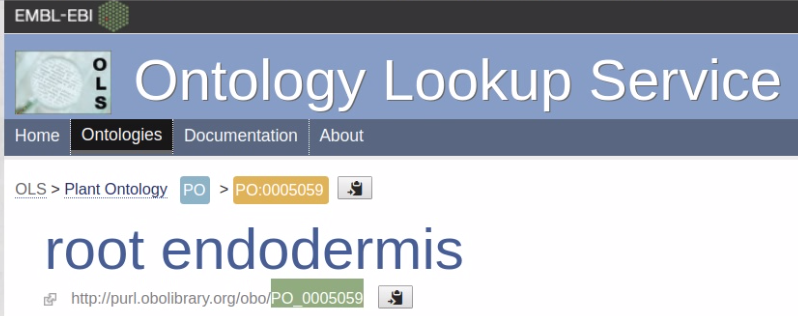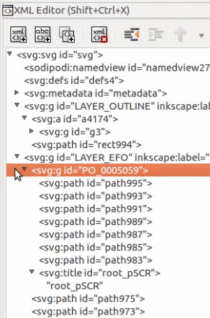</center><p/>  

Annotate other tissues in the same way.  


## Outline Shapes

If there are outline shapes, they should be placed in the 'LAYER_OUTLINE' layer. For illustration purpose, a root outline is created.   

Click 'Outline' in the layer panel, and draw an outline as explained [above](#draw). Then the outline shape is created in the 'Outline' layer.  

  <p/><center>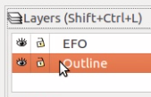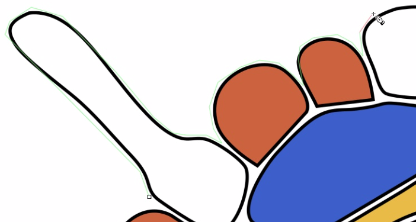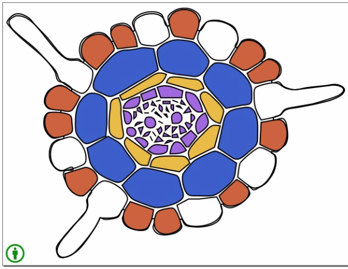</center><p/>  

Make sure all paths have absolute coordinates as shown in Section [Absolute Path Position](#abs).  

## Resize Page

To ensure that the correct height and width are set, go to 'Document Properties...' under 'File ' tab, and select 'Custom size' under 'Page' tab, then set 'Units' to 'px' and click on 'Resize page to drawing or selection'.  

  <p/><center>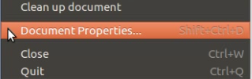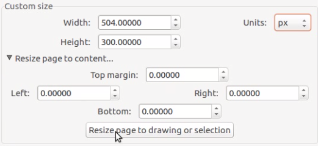</center><p/>  

## Tissue Shape Style

According to EBI guidlines, all tissue shapes ('EFO' layer) are expected to have `style="fill:none; stroke:none"`. To do so, click on the 'EFO' in layer panel, select all tissue shapes (Ctrl+A), then click 'No paint' under both 'Fill' and 'Stroke paint' in 'XML Editor' panel. Then all the tissue shapes are transparent.  

  <p/><center>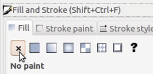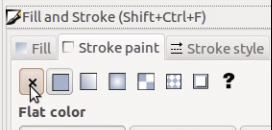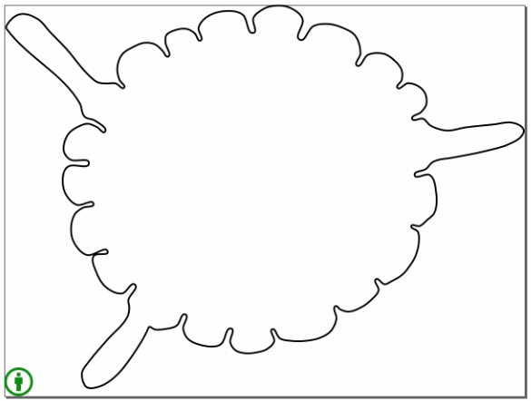</center><p/>  

The EBI SVG follows the naming scheme '\<species\>[.view].svg', so this image can be saved as 'arabidopsis_thaliana.root_cross.svg', which is downloadable [here](https://raw.githubusercontent.com/jianhaizhang/SVG_tutorial_file/master/download/arabidopsis_thaliana.root_cross.svg).   

# Spatial Heatmap

Both 'root_cross_simple.svg' and 'arabidopsis_thaliana.root_cross.svg' are ready to use for plotting spatial heatmaps. The latter is packaged in `spatialHeatmap` and is accessed below.   

```{r eval=TRUE, echo=TRUE, warnings=FALSE}
svg.root <- system.file('extdata/shinyApp/example/arabidopsis_thaliana.root_cross.svg', package='spatialHeatmap')
```

Plot spatial heatmaps on gene `HRE2`. In Figure 1, it is manifest that gene `HRE2` is showing higher expression level in `hypoxia` than in `control`, and thus might play an interesting role in hypoxia resistance.     

<a name='shm'></a>
```{r eval=TRUE, echo=TRUE, warnings=FALSE, fig.align="center", fig.cap=('Figure 1 Spatial Heatmaps. The matching tissues between data and aSVG are colored in the middle spatial heatmaps. On the right is the legend plot, where matching tissues are labeled.'), out.width="100%"}
spatial_hm(svg.path=svg.root, data=se.fil.arab, sam.factor='samples', con.factor='conditions', ID=c("HRE2"), height=0.4, legend.nrow=3, legend.r=1.3, legend.key.size=0.3)
```

# Supplement

This section presents details of data formatting on `vector` and `data frame`.  

## Vector

The data class `vector` applies to several numeric values measured for a single item (*e.g.* gene). If one or more conditions are provided, the samples and conditions should be connected by double undescore, i.e. in the form of 'sample_\_condition'. Since '_\_' is a reserved separator, the naming scheme of 'sample' and 'condition' should not use it. If no conditions are provided, all the samples are assumed to have same condition.   

Take the samples and conditions in [Table 1](#tar_arab) for example. The two samples are 'root_pGL2' and 'root_pCO2' and two conditions are 'control' and 'hypoxia'. Assume the two samples have matching counterparts in the aSVG. Since there are two conditions for each sample, the `vector` should contain four target values. The following code generates five random values so that the first four are the target values while the last one is from a third assumed sample that has no counterparts in the aSVG.  

```{r eval=TRUE, echo=TRUE, warnings=FALSE }
# Random numeric values.
vec <- sample(x=1:100, size=5)
```

Name the first 4 values with the scheme 'sample_\_condition', and last with a random name `notMapped`. Note each value has a unique name.  

```{r eval=TRUE, echo=TRUE, warnings=FALSE }
# Give unique names to random values.
names(vec) <- c('root_pGL2__control', 'root_pGL2__hypoxia', 'root_pCO2__control', 'root_pCO2__hypoxia', 'notMapped')
vec
```

## Data Frame

The class `data frame` applies to more items (e.g. genes) assayed in several samples and/or conditions (e.g. 2 samples under 2 conditions). Columns and rows are samples/conditions and assayed items respectively. Similarly, if one or more conditions are provided, the column names should follow the scheme 'sample_\_conditio'. If no conditions are provided, all the samples are assumed to have same condition.  

Take the same samples and conditions in the `vector` case as example. Make a numeric data frame of 20 rows and 5 columns.   

```{r eval=TRUE, echo=TRUE, warnings=FALSE }
# Make a numeric data frame.
df.test <- data.frame(matrix(sample(x=1:1000, size=100), nrow=20))
```

Name columns with the names in above `vector` and rows with 20 genes (gene1, gene2, ..., gene20).  

```{r eval=TRUE, echo=TRUE, warnings=FALSE }
# Name the columns.
colnames(df.test) <- names(vec)
# Name the rows.
rownames(df.test) <- paste0('gene', 1:20)
# A slice of the data frame.
df.test[1:3, ]
```

In the downstream interactive network (refer to the package [vignette](https://jianhaizhang.github.io/SVG_tutorial_file/vignette.html)), if users want to have a gene annotation by mousing over a node, a column of gene annotation can be appended to the data frame. For example, the 20 genes are annotated as ann1, ann2, ..., ann20.   

```{r eval=TRUE, echo=TRUE, warnings=FALSE }
df.test$ann <- paste0('ann', 1:20)
df.test[1:3, ]
```

```{r eval=TRUE, echo=TRUE, warnings=FALSE }
sessionInfo()
```

# Reference


